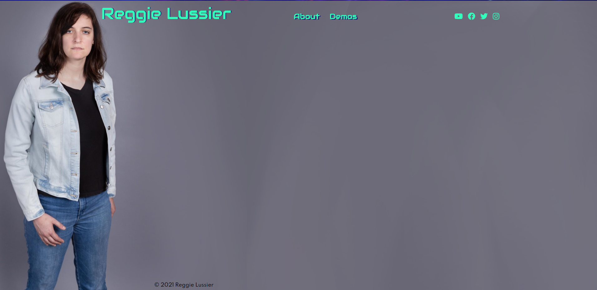
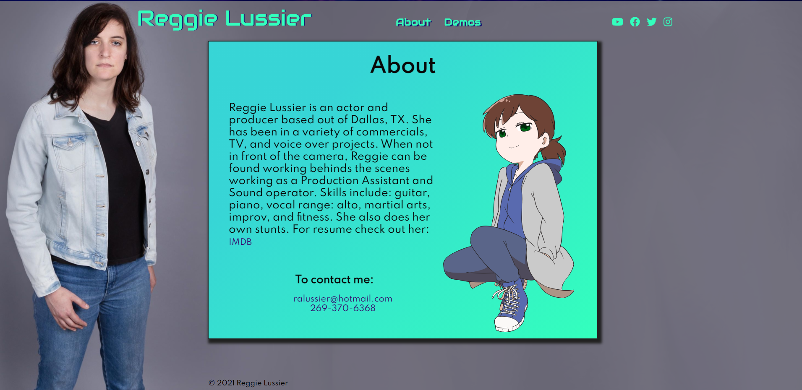
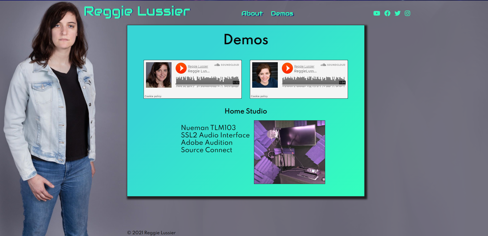

<h1>Reggie Lussier's Actor Website</h1>
This is my actor portfolio website using the Gatsby framework, React, and SASS framework. 

<h2>Home Page</h2>

<h2>About Page</h2>

<h2>Demos Page</h2>

<h3>Framework Links</h3>
<a href="https://www.gatsbyjs.com/" target="_blank">Gatsby</a>
<a href="https://sass-lang.com/" target="_blank">Sass</a>
<a href="https://reactjs.org/" target="_blank">React</a>

<h3>Website Link:</h3>
<a href="https://rlussier.github.io/reggielussier">https://rlussier.github.io/reggielussier</a>
